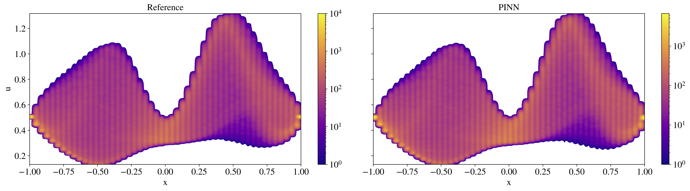

# Towards causal Representation Learning

 Bernhard Schölkopf , Francesco Locatello , Stefan Bauer , Nan Rosemary Ke , Nal Kalchbrenner
 Anirudh Goyal, Yoshua Bengio

Sofia Zervaki, 2025

---
# I. Introduction

- ML struggles with strong generalization.

- ML systems often ignore:
  - Interventions
  - Domain shifts
  - Temporal structure

- Most ML success comes from recognizing patterns in i.i.d. data.

The paper outlines some key ML challenges where causality matters.

--
# Issue 1: Robustness

- Deep learning models often fail under small changes in input data.
- Benchmarks evaluate models under such shifts, with solutions like
  - Data augmentation
  - Pre-training
  - Self-supervision
  - Architectures with inductive biases

- The authors argue that those fixes may not be sufficient 
- To generalize beyond the i.i.d setting we need **Causal Models** which go beyond just spotting patterns


--

# Issue 2: Learning Reusable Mechanisms

- Humans learn intuitively

- This lets them reuse knowledge to learn new tasks quickly

- For ML Systems, Agents should build modular representations of the world

  - Each module = a causal mechanism (like gravity, friction, etc.)

As a result 

- In new tasks/environments only some modules need updating

- Most knowledge can be reused without retraining


--

# A Causality Perspective: 

- Conditional probabilities don’t explain what happens when we intervene

- Intervention
  - Causality requires reasoning about actions and changes
  - Goes beyond what’s observed and includes
    - Hypothetical scenarios
    - Counterfactuals
    - Deliberate reasoning
    
---

#  II. LEVELS OF CAUSAL MODELING

## Physical Models

Gold standard: A set of differential equations describe how physical systems evolve over time.

These equations:  - Predict future behavior
                  - Describe interventions and causal structure
                  - Provide physical insight


Example:

$ \frac{dx}{dt} = f(x)$, with $x \in R^d$ and initial value $x(t_0)=x_0$

By Picard–Lindelöf, this has a unique solution if $f$ is Lipschitz


--
Summary of different modeling approaches


| Model Type           | Predict in i.i.d. | Predict under shift/intervention | Answer counterfactuals | Obtain physical insight | Learn from data |
|----------------------|------------------|----------------------------------|-------------------------|--------------------------|------------------|
| Mechanistic/Physical | Yes              | Yes                              | Yes                     | Yes                      | ?                |
| Structural Causal    | Yes              | Yes                              | Yes                     | ?                        | ?                |
| Causal Graphical     | Yes              | Yes                              | No                      | ?                        | ?                |
| Statistical          | Yes              | No                               | No                      | No                       | Yes              |


---
# Inline Math

This is Einstein's formula: $E = mc^2$


---

# Block Math

$$
\int_0^\infty e^{-x^2} dx = \frac{\sqrt{\pi}}{2}
$$

---

# Vertical slides

This is the parent of vertical slides.

--
## Vertical slide 1

This is a vertical slide under the parent slide.

--
## Vertical slide 2

Another vertical slide under the parent slide.

---

# Add figures

Add a figure with Markdown code

```markdown
    
```


--

or with HTML code for more control

```html

```


--

or with percentage

```html

```


--

You can add a caption like this
```html
<figure>
  
  <figcaption>Figure 1: Histogram of the solution of a bistable ODE</figcaption>
</figure>
```

<figure>
  
  <figcaption>Figure 1: Histogram of the solution of a bistable ODE</figcaption>
</figure>

---

# Show a video

```html
<video src="media/video.mp4" autoplay muted loop style="width: 60%"></video>
```

<video src="media/video.mp4" autoplay muted loop style="width: 60%"></video>


---

# Code blocks

<pre><code class="language-python" data-trim>
def fibonacci(n):
    if n <= 1:
        return n
    return fibonacci(n-1) + fibonacci(n-2)
</code></pre>


--

# Code blocks with highlighting

<pre><code class="language-python" data-trim data-line-numbers="3,5-6,10">
import numpy as np
import matplotlib.pyplot as plt

def simulate_ode(f, y0, t):
    """Simple forward Euler ODE solver."""
    y = np.zeros_like(t)
    y[0] = y0
    for i in range(1, len(t)):
        dt = t[i] - t[i-1]
        y[i] = y[i-1] + dt * f(t[i-1], y[i-1])
    return y

# Example usage
f = lambda t, y: -0.5 * y
t = np.linspace(0, 10, 100)
y = simulate_ode(f, 1.0, t)

plt.plot(t, y)
plt.title("Exponential Decay")
plt.xlabel("Time")
plt.ylabel("y(t)")
plt.grid()
plt.show()
</code></pre>


--

<section>
  <h3>Code blocks with animations</h3>

  <div class="fragment">
    <pre><code class="language-python" data-trim data-line-numbers>
import numpy as np
import matplotlib.pyplot as plt
    </code></pre>
  </div>

  <div class="fragment">
    <pre><code class="language-python" data-trim data-line-numbers>
def simulate_ode(f, y0, t):
    """Simple forward Euler ODE solver."""
    y = np.zeros_like(t)
    y[0] = y0
    for i in range(1, len(t)):
        dt = t[i] - t[i-1]
        y[i] = y[i-1] + dt * f(t[i-1], y[i-1])
    return y
    </code></pre>
  </div>

  <div class="fragment">
    <pre><code class="language-python" data-trim data-line-numbers>
f = lambda t, y: -0.5 * y
t = np.linspace(0, 10, 100)
y = simulate_ode(f, 1.0, t)
    </code></pre>
  </div>

  <div class="fragment">
    <pre><code class="language-python" data-trim data-line-numbers>
plt.plot(t, y)
plt.title("Exponential Decay")
plt.xlabel("Time")
plt.ylabel("y(t)")
plt.grid()
plt.show()
    </code></pre>
  </div>
</section>


---

### 🦧 That is all 🦧


