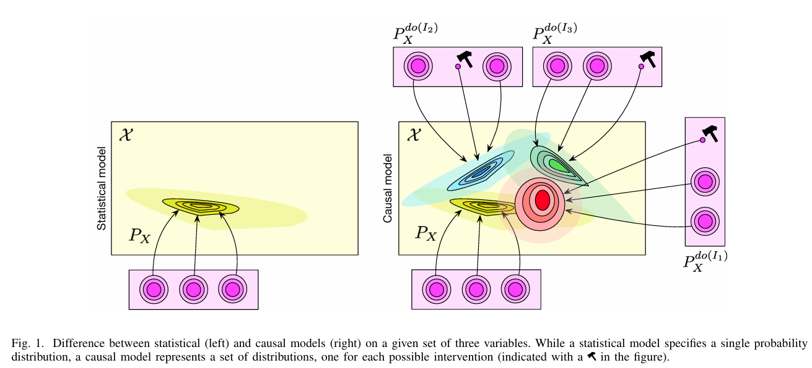
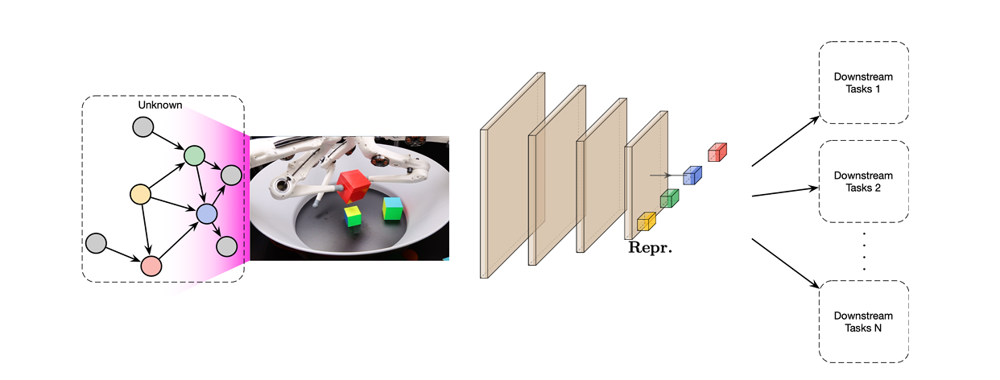
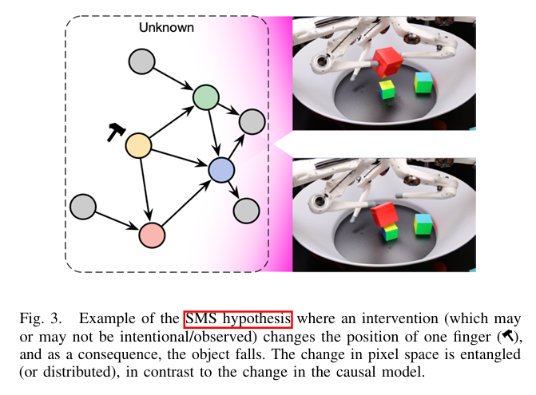

# Towards causal Representation Learning

 Bernhard Schölkopf , Francesco Locatello , Stefan Bauer , Nan Rosemary Ke , Nal Kalchbrenner
 Anirudh Goyal, Yoshua Bengio

Sofia Zervaki, 2025, b

---
# I. Introduction

- ML struggles with strong generalization.

- ML systems often ignore:
  - Interventions
  - Domain shifts
  - Temporal structure

- Most ML success comes from recognizing patterns in i.i.d. data.

The paper outlines some key ML challenges where causality matters.

--
# Issue 1: Robustness

- Deep learning models often fail under small changes in input data.
- Benchmarks evaluate models under such shifts, with solutions like
  - Data augmentation
  - Pre-training
  - Self-supervision
  - Architectures with inductive biases

- The authors argue that those fixes may not be sufficient 
- To generalize beyond the i.i.d setting we need **Causal Models** which go beyond just spotting patterns

--

# Issue 2: Learning Reusable Mechanisms

- Humans learn intuitively

- This lets them reuse knowledge to learn new tasks quickly

- For ML Systems, Agents should build modular representations of the world

  - Each module = a causal mechanism (like gravity, friction, etc.)

As a result 

- In new tasks/environments only some modules need updating

- Most knowledge can be reused without retraining

--

# A Causality Perspective: 

- Conditional probabilities don’t explain what happens when we intervene

- Intervention
  - Causality requires reasoning about actions and changes
  - Goes beyond what’s observed and includes
    - Hypothetical scenarios
    - Counterfactuals
    - Deliberate reasoning
    
---

#  II. LEVELS OF CAUSAL MODELING

## Physical Models

Gold standard: A set of differential equations describe how physical systems evolve over time.

These equations:  

  - Predict future behavior
  - Describe interventions and causal structure
  - Provide physical insight

Example:

$ \frac{dx}{dt} = f(x)$, with $x \in R^d$ and initial value $x(t_0)=x_0$

By Picard–Lindelöf, this has a unique solution if $f$ is Lipschitz

--
# Summary of different modeling approaches

| Model Type           | Predict in i.i.d. | Predict under shift/intervention | Answer counterfactuals | Obtain physical insight | Learn from data |
|----------------------|------------------|----------------------------------|-------------------------|--------------------------|------------------|
| Mechanistic/Physical | Yes              | Yes                              | Yes                     | Yes                      | ?                |
| Structural Causal    | Yes              | Yes                              | Yes                     | ?                        | ?                |
| Causal Graphical     | Yes              | Yes                              | No                      | ?                        | ?                |
| Statistical          | Yes              | No                               | No                      | No                       | Yes              |

--

#  A. Predicting in the i.i.d. setting

- Statistical models are trained to approximate probabilities 

- For a given set of input examples X and target labels Y, we want approximating $P(Y|X)$ 

- This works well for standard prediction tasks, but 

**Accurate predictions is not equal to causal understanding**

- they can fail when the distribution of the data changes (intervention, real-world actions etc.)

--

#  B. Predicting Under Distribution Shifts

- Interventions change variable values or their relationships, violating i.i.d. assumptions.

- Classical ML models often fail when deployed in real-world settings where distributions shift

- Causal models help build systems that remain accurate under such changes.

- Robust prediction requires more than test set accuracy. We need to trust that
    - **the predictions of the algorithm will remain valid if the conditions change**

--
#  C. Answering Counterfactual Questions

- Counterfactuals imagine what could have happened if actions were different.

- Harder than interventional questions but important for intelligent reasoning.

- Example:
  - "Would a patient have avoided heart failure if they exercised earlier?"

- Important for AI to reflect on past decisions and learn from alternatives.

- Critical in reinforcement learning for hypothesis testing and improving policies.

--

#  D. Nature of Data: Observational, Interventional, (Un)structured

- Data types matter for causal inference:
  - **Observational** (i.i.d. or with unknown shifts) vs. **Interventional** (known changes)
  - **Hand-engineered** (structured features) vs. **Raw** (images, audio)

- Statistical models work with observational/raw data but can't reveal causality

- Causal learning often needs
  - Data from multiple environments or known interventions
  - Assumptions like causal sufficiency

---

#  III. CAUSAL MODELS AND INFERENCE

- This section explores the difference between statistical and causal models.

- It also introduces a formal framework for reasoning about interventions and distribution shifts.

--

# A. Methods driven by i.i.d. data

- Most ML successes rely on

  - Large labeled datasets (human-made or simulated)

  - High-capacity models (neural nets etc.)

  - Powerful computing resources.

  - **i.i.d. assumption**

--

- Limitations of i.i.d.
  - Fails under distribution shifts:
    - Different real-world conditions (different clinics or countries)
    - Adversarial examples break models with small image changes
    - Models confuse cause and effect 
  - i.i.d. systems lack causal understanding

    - Cannot reason about interventions
    - Struggle in dynamic or changing environments

--

# B. The Reichenbach Principle: From Statistics to Causality

  <strong>Reichenbach’s Common Cause Principle:</strong>If X and Y are statistically dependent, there's a variable Z causing both, such that X ⟶ Z ⟶ Y explains the dependence.

- Limitation of Observational Data:

  - Can't distinguish between causal structures (X ⟶ Y vs Y ⟶ X vs Z ⟶ both)

  - All produce the same observed dependence

- More Variables Help:
  - Conditional independence between variables can reveal causal direction

  - Leads to causal graphs and structural causal models (SCMs)

--

#  C. Structural causal models (SCMs)

- **SCM Definition**: Each variable $ X_i := f_i (PA_i, U_i) $
  - $PA_i$ is the parent variables (causes)
  - $U_i$ is the independent noise (captures randomness)
  - It is represented as a Directed Acyclic Graph (DAG)

--
**Key Concepts**
- Causal Markov Condition: $X_i$ is independent of non-descendants given $PA_i$
- Causal Factorization:
    $$ P(X_1, X_2,...,X_n) = \prod_{i=1}^n  P(X_i|PA_i)$$

    Which reflects causal structure, unlike arbitrary factorizations
- Latent Variables: some variables may be unobserved (latent), which can confuse causal relationships
- Learning: Observational data + independence tests -> partial graph structure

--

 **Interventions in SCMs**

- No intervention: Passive observation

- Hard (perfect): Set variable to fixed value

- Soft (imperfect): Modify function or noise 

- Uncertain: Don’t know which variable or function was changed.

Knowing which interventions are possible/allowed helps guide causal discovery and ensures the model is useful for real tasks.

 

--
# D. Difference Between Statistical Models, Causal Graphical Models, and SCMs

- **Statistical models** capture correlations but can't distinguish cause from effect or handle interventions.

- **Causal graphical models** add directionality (cause -> effect) and allow us to model interventions.

- **Structural Causal Models (SCMs)**:
  - Define variables as functions of their causes and noise: $X_i = f_i(PA_i,U_i)$
  - Enable reasoning about interventions (changing the system) and counterfactuals (what would have happened).

---

#  IV. INDEPENDENT CAUSAL MECHANISMS

- A system's generative process consists of independent modules (mechanisms) that do not inform or influence one another.

- This implies:

  - Modularity: Each causal mechanism operates independently.

  - Separate intervenability: You can intervene on one mechanism without affecting others.

  - Invariance: Mechanisms stay stable across settings or interventions.

--
**Sparse Mechanism Shift (SMS) Hypothesis**

- When distribution shifts occur (e.g., across domains), they typically affect only a few mechanisms in the causal model.

- Contrast:
  - Causal factorization: Shift is localized, easier to generalize across settings.
  - Statistical (entangled) factorization: Shift spreads across many terms, harder to adapt.

- Supports robust generalization, transfer learning, and domain adaptation

--
**Algorithmic View of Independent Causal Mechanisms (ICM)**

- Mechanism independence can be formalized via algorithmic information theory:

  - A mechanism = bit string (shortest program encoding it).

  - Two mechanisms are independent if compressing them together doesn’t save space.

- Suggests causality is not limited to statistics.

  - Leads to algorithmic causal models using Kolmogorov complexity.

  - Independent programs (noise terms) ⟺ Independent mechanisms

--

---

#  V. CAUSAL DISCOVERY AND MACHINE LEARNING

- Learn causal structure from data 
- Challenges:

  - Conditional independence testing is hard with finite, high-dimensional data.

  - Doesn’t work well in the 2-variable case.

- Solution: Use assumptions about function classes (common in ML).

--

**Additive Noise & Distribution Shifts**

- Additive Noise Models (ANMs):

$$Y = f(X) + noise$$

  - Helps identify causal direction (X→Y fits, Y→X doesn't).

- Distribution Shifts Help:

  - Causal structure is invariant across environments.

  - Use data from different contexts/tasks (e.g., interventions, time, views).

--

**Modern Approaches**

- Neural networks: Learn causal graphs via continuous optimization.

- Reinforcement learning: Agents explore to discover causality.

- Causal models are expected to generalize better under changes than purely predictive ones.

---

# VI. LEARNING CAUSAL VARIABLES

--

--
- Observations $X = G(S_1 ... S_n)$. High-dimensional data is a nonlinear mixture of underlying causal variables.

- Goal: Learn a representation that reveals these causal variables and their relations.

- Neural networks map raw data to meaningful high-level variables to support downstream tasks.

- Causal inductive biases like Sparse Mechanism Shift (SMS) hypothesis help learning.

--

**Challenges in Learning Causal Variables**

- Causal variables are not given, they must be learned from data.

- Variables depend on the granularity of the data and available interventions or distribution shifts.

- Representation learning aims for robustness, interpretability, and fairness.

- Need to embed causal models inside larger ML models with high-dimensional inputs/outputs.

--

# Problem 1 — Learning Disentangled Representations

- Disentanglement means representing data as independent factors corresponding to causal variables.

- The Independent Causal Mechanisms (ICM) principle implies noise variables should be independent.

- Encoder-decoder frameworks (autoencoders) can learn latent variables that ideally correspond to causal factors.

- Object-centric learning as a special case of disentanglement.

--
# Using the ICM Principle for Causal Learning

- Make noise terms $U_i$ statistically independent.

- Mechanisms should be independently manipulable and invariant across problems.

- SMS hypothesis: sparse changes in mechanisms help identify causal factors.

- Different supervision signals or interventions affect which variables can be disentangled.

--
# Problem 2 — Learning Transferable Mechanisms

- Real-world agents face limited data and computational resources.

- Modular structures reflecting the modularity of the world help reuse knowledge across tasks.

- Example: Visual system factors out lighting variations rather than relearning face recognition.

- Bias towards models with structural similarity (homomorphism) to the real world's modular structure.

--

# Problem 3 — Learning Interventional World Models and Reasoning

- Deep learning captures statistical dependencies but ignores causal intervention properties.

- Causal models enable reasoning, planning, and imagining alternative scenarios (thinking as acting in imagined space).

- Importance of representing oneself and “free will” for social and cultural learning (future research frontier).

--

--

- Pixel-level changes appear widespread and entangled.

- Causal model shows localized, sparse changes, which is easier to interpret and reason about.

---

# VII. IMPLICATIONS FOR MACHINE LEARNING
##  A. Semi-Supervised Learning (SSL)

- Traditional ML assumes data is i.i.d. (same distribution in train & test)

- Causal perspective: distributions may change, but causal mechanisms stay mostly stable

- This challenges how we use unlabeled data in SSL

--

### SSL and Causal Direction

Assume causal graph: X -> Y (X causes Y)

Joint distribution factorizes as  $ P(X, Y) = P(X) \times P(Y | X) $

ICM Principle:  $P(X)$ and $P(Y | X)$ are independent

Implication: Knowing $P(X)$ (unlabeled data) does not help improve $P(Y | X)$

Conclusion ->  SSL is expected to be ineffective in this causal direction

--

**SSL works better in the Anticausal Direction**

- Predicting cause from effect ( Y -> X)
- Marginal $P(X)$ contains info about conditional $P(Y|X)$
- Unlabeled data helps improve learning
- Example: Image classification where label -> image (anticausal)

--

**Relation to SSL Assumptions**

- Cluster assumption: labels stable within clusters of $P(X)$

- Low-density separation: decision boundaries lie in low-density regions

- Smoothness: nearby points in $P(X)$ have similar outputs

- These assumptions align with SSL success in anticausal settings

---
# VII. IMPLICATIONS FOR MACHINE LEARNING
## B. Adversarial Vulnerability

- Adversarial attacks violate i.i.d. -> exploit non-causal features.

- Causal models (true generative direction) may be more robust.

- Robustness improves when classifiers align with causal structure.

- Defenses:
  - Analysis by synthesis (model label -> input)
  - Autoencoder preprocessing to remove spurious perturbations

---
# VII. IMPLICATIONS FOR MACHINE LEARNING
## C. Robustness and Strong Generalization

- Causal models enable robustness to interventions & distribution shifts.

- Use causal features (not just correlations) for better generalization.

- Goal: Minimize worst-case risk across environments (e.g., different settings).

- Requires modeling interventions and training on diverse data.

---
# VII. IMPLICATIONS FOR MACHINE LEARNING
## D. Pre-training, Data Augmentation, and Self-Supervision

- Pre-training: Use large, diverse datasets to improve generalization.

- Augmentation: Apply synthetic changes (e.g. flips, crops) to build invariance.

- Self-Supervision: Use unlabeled data + pretext tasks to learn transferable features.

- Goal: Robust learning across varied environments with minimal labeled data.

---
# VII. IMPLICATIONS FOR MACHINE LEARNING
## E. Reinforcement Learning

- Causal Perspectives in RL:

  - On-policy RL estimates do-probabilities directly.

  - Off-policy / batch RL faces causal inference challenges due to observational data.

--

- a. World Models
  - Model-based RL = learn causal effects of actions.

  - Generative models simulate environments for safe agent training.

  - Structured models can capture entities + causal relations.

--
- b. Generalization & Transfer
  - RL agents struggle with generalization & data efficiency.

  - Solution: learn invariant causal mechanisms to adapt to changes.

  - Exploration (interventions) helps uncover causal structure.

--

- c. Counterfactuals
  - Improve learning & decision-making by reasoning about “what could have happened.”

  - Supports data efficiency, multi-agent communication, and planning.

--

- d. Offline RL
  - Learn from fixed datasets (no interaction).

  - Requires counterfactual reasoning to infer unseen actions’ outcomes.

  - Causal modeling (e.g., invariances) can reduce distribution shift issues.

 
---
# VII. IMPLICATIONS FOR MACHINE LEARNING
## F. Scientific Applications

Goal -> Use ML to complement (not replace) scientific understanding, with causality playing a key role.

--

- Physics Simulations
  - Neural networks boost efficiency of simulators.

  - Works well in controlled environments, but needs retraining if conditions change.

--

- Healthcare & Medicine
  - Personal health models (e.g. from EHR, genetics) require causal understanding to ensure reliable treatment recommendations.

  - Training on doctors' decisions alone may fail in real-world settings.

  - Causal models improve personalized medicine and pandemic analysis (e.g. Simpson’s paradox in COVID-19).

--

- Astronomy

  - Causal models help remove measurement confounding in exoplanet detection.

  - Enabled recovery of hidden signals -> discovery of 36 candidates, 21 validated.

  - Led to finding water on exoplanet K2-18b, in the habitable zone.

---
# VII. IMPLICATIONS FOR MACHINE LEARNING
##  G. Multi-Task Learning and Continual Learning

- The Problem:
  - Current AI is narrow - strong at specific tasks, weak at generalizing across diverse environments.

- Humans excel due to:

  - Discovering high-level abstractions

  - Recognizing causal relationships

  - Adapting to out-of-distribution (OOD) settings

--

**Multi-Task Learning**

- Aim: Solve multiple tasks across varying environments.

- Core idea: Share representations across tasks.

- Causal models can help by learning shared data-generating processes with components satisfying the Sparse Mechanism Shift (SMS) hypothesis.

- Evidence shows causal models adapt faster to sparse distribution shifts.

--

- Why Not Just Scale Models?
  - Big models (e.g. large language or vision transformers) do generalize surprisingly well across interventions if:

  - Data is sufficiently diverse (which is not always testable).

  - Assumptions match the real-world dynamics.

- But:

  - Worst-case generalization errors can still be high under distribution shifts.

  - Purely scaling doesn't explicitly capture environment structure or causal factors.

--

**Why Causality Still Matters**
- Causality makes assumptions explicit and interpretable.

- The Independent Causal Mechanisms (ICM) principle supports decomposing environments into modular, reusable parts.

- Useful for:

  - Generalizing across related environments

  - Designing modular ML systems

  - Enforcing structure aligned with physical and cognitive insights

--

Causality complements deep learning. 

Combining both may be essential to build robust, general-purpose, and adaptable AI.

---

# VIII. CONCLUSION

We explored the intersection of causality and machine learning, covering:

- Fundamentals of causal inference

- Independent Causal Mechanisms (ICM) and invariance as useful inductive biases

- Learning from observational & interventional data when causal variables are known

- The open challenge of causal representation learning

- Applications to open ML problems: semi-supervised learning, domain generalization, and robustness

--

## a. Learning Non-Linear Causal Relations at Scale

- Use modern ML to model complex, scalable causal relations

- Research goals:

  - When can we reliably learn non-linear causal structure?

  - Which ML frameworks are best suited?

  - Show causal models outperform statistical ones in generalization & reuse

--

## b. Learning Causal Variables

- Current deep models output entangled vector-based representations

- Need:

  - Modular, flexible representations (e.g., variable number of objects)

  - Causal representations that adapt to the task and interventions

  - Study how and when these variables can be reliably extracted

--

## c. Understanding Biases in Deep Learning

- Current robustness gains stem from data scale, augmentation, and pre-training, but:

  - Which elements really help? Why?

  - We need a taxonomy of inductive biases aligned with causality

  - Pre-training choices should be examined for their causal generalization impact

--

## d. Causal Models for World & Agent (in RL)

- In many RL settings, no abstract state space is given

- Goal: learn causal variables from raw data (e.g., pixels)

- Needed for:

  - Causal induction in real-world tasks

  - Building causal world models that support planning, robustness, and generalization

---

### Thank you!

