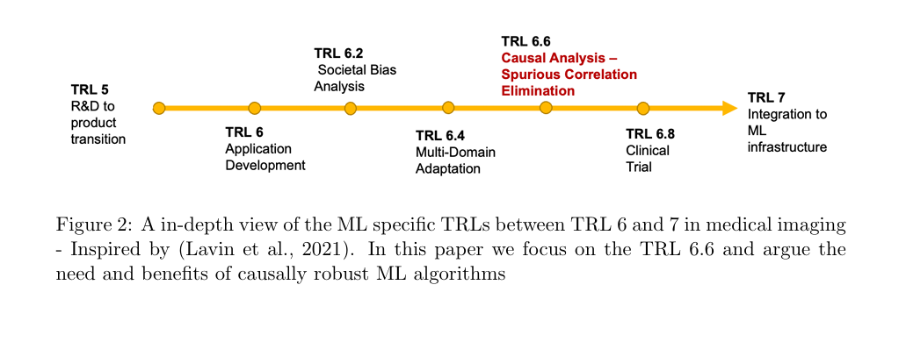
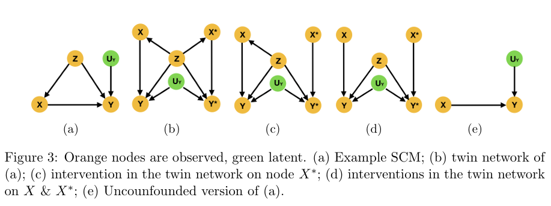

# A Review of Causality for Learning Algorithms in Medical Image Analysis

 Athanasios Vlontzos, Daniel Rueckert, Bernhard Kainz

Sofia Zervaki, 2025

---
# Introduction

- Medical imaging covers MRI, CT, X-ray, and Ultrasound -> crucial for diagnosis & monitoring.

- ML has shown success in lesion detection, segmentation, and scan alignment.

- Many AI methods fail in clinical practice due to poor robustness & skipped readiness stages

--

--

- TRLs describe the stages from research -> deployment.

- Many ML systems in medical imaging jump from TRL 4 (PoC) -> TRL 7 (Integration).

- This skips TRL 5-6, where algorithms are made robust and production-ready.
    

--

---

#  Why Causality Matters in Medical Imaging

- Current AI/ML often confuses correlation and causation

  - Example: COVID-19 X-rays ->  models learned hospital IDs/ethnicity, not disease (DeGrave et al., 2021).

- Domain shifts reduce robustness:

  - Population shifts – disease prevalence differs across regions.

  - Acquisition/annotation shifts – scanner settings, radiologist biases.

  - Data selection bias – limited datasets in medical domains.

- Causal analysis can mitigate these biases -> safer & more adaptable ML.

--
# Background 

- *Structural Causal Models (SCM)*

  - Represent cause–effect relations with variables and functions.

  - Use Directed Acyclic Graphs (DAGs) to show dependencies.

- *Do-Operator (do(x))*

  - Simulates interventions: "What happens if we force X = x?"

  - Lets us estimate causal effects, not just correlations.

--

  
# Counterfactual Inference & Twin Networks

- Counterfactuals “What would Y have been if X had been different?”

- Computed using SCM and latent variables (U).

- Two main methods

  - Abduction–Action–Prediction: infer latent U -> intervene -> predict outcome.

  - Twin Network: duplicate model for factual & counterfactual worlds -> jointly compute effects.

--

---

# Potential Outcomes & Average Treatment Effect (ATE)

- Potential Outcomes: Predict what would happen with and without a treatment.

 - Y_{1,i} = outcome for unit i receiving the treatment
 - Y_{0,i} = outcome for unit i not receiving the treatment

- Causal Effect (Individual): Difference between outcomes:
 - tau = Y_{1,i} - Y_{0,i}

- Average Treatment Effect (ATE): Average effect across a population: \tau_{ATE} = E[Y_1 - Y_0]
- Propensity Score: Probability of receiving treatment given covariates 
 - helps match treated & untreated units for fair comparison.

---
# Causal Discovery in Medical Imaging
- Common Assumptions:

  - Acyclicity: DAG structure (no cycles).

  - Markovian: Node independent of non-descendants given parents.

  - Faithfulness: All conditional independences represented in DAG.

  - Sufficiency: No hidden common causes.

--

- Approaches:

  - Constraint-based: Test conditional independence (e.g., PC, FCI).

  - Score-based: Search for best DAG using a score (e.g., GES, BIC).

  - Optimization-based: Learn DAGs via continuous optimization

 ---
 # Thank you!

