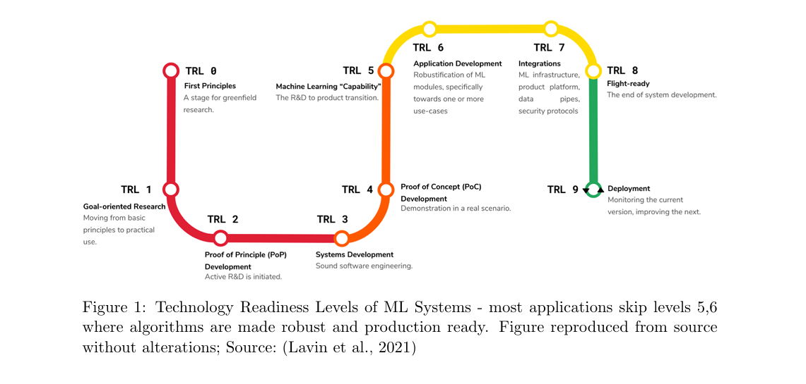

# A Review of Causality for Learning Algorithms in Medical Image Analysis

 Athanasios Vlontzos, Daniel Rueckert, Bernhard Kainz

Sofia Zervaki, 2025

---
# Introduction

- Medical imaging covers MRI, CT, X-ray, and Ultrasound -> crucial for diagnosis & monitoring.

- ML has shown success in lesion detection, segmentation, and scan alignment.

- Many AI methods fail in clinical practice due to poor robustness & skipped readiness stages

--

--

- TRLs describe the stages from research -> deployment.

- Many ML systems in medical imaging jump from TRL 4 (PoC) -> TRL 7 (Integration).

- This skips TRL 5-6, where algorithms are made robust and production-ready.
    

--

--

#  Why Causality Matters in Medical Imaging

- Current AI/ML often confuses correlation and causation

  - Example: COVID-19 X-rays ->  models learned hospital IDs/ethnicity, not disease (DeGrave et al., 2021).

- Domain shifts reduce robustness:

  - Population shifts – disease prevalence differs across regions.

  - Acquisition/annotation shifts – scanner settings, radiologist biases.

  - Data selection bias – limited datasets in medical domains.

- Causal analysis can mitigate these biases -> safer & more adaptable ML.

---
# Background 

*Structural Causal Models (SCM):*

- Define relationships between
  - Latent variables U
  - Observed variables V
  - Functions F

- Use Directed Acyclic Graphs (DAGs) to show dependencies.

  - Each observed variable:

     $v_i =f_i (PA_i, u_i)  $

  where $PA_i$ are the parent nodes of $v_i$

  - Together (U,V,F) induce a distribution P(V)

--

*Do-Operator (do(x))*

  - Simulates interventions: What happens if we force X = x,  do(X=x)?

  - Lets us estimate causal effects, not just correlations.
   - P(Y|do(X=x))

--

# Counterfactual Inference & Twin Networks

- Counterfactuals “What would Y have been if X had been different?”

 - Computed using SCM and latent variables (U).
 

- Two main methods for answering Counterfactuals

  - Abduction–Action–Prediction: infer latent U -> intervene -> predict outcome.

  - Twin Network: duplicate model for factual & counterfactual worlds -> jointly compute effects.

--

---

# Potential Outcomes & Average Treatment Effect (ATE)

--

# Potential Outcomes-Basic Idea
- Each unit (patient, image, etc.) has two possible outcomes depending on whether a treatment is applied.

  - $Y(a)$ = outcome if intervention/action $a$ is applied
  - $C$ = set of possible interventions

- We want to estimate causal effect by comparing outcomes under different action

--

# Potential Outcomes

- For each unit i
 - $Y_{1,i}$ outcome if treated
 - $Y_{0,i}$ outcome if not treated

- The causal effect for a single unit
 $\tau_i = Y_{1,i} - Y_{0,i}$

This is the difference between the treated and untreated outcomes for that unit.

--

# Average Treatment Effect (ATE)

- The average causal effect across all units in the population is

$\tau_{ATE} = \frac{1}{N} \sum_i^N  Y_{1,i} - \frac{1}{N} \sum_i^N  Y_{0,i} = E[Y_1 - Y_0] = E[\tau_i]$

- how the treatment changes outcomes on average

--

# Propensity Score

$e = P(T|X)$ is the probability of receiving the treatment given covariates X

- Used to match treated & untreated units with similar characteristics

- It helps simulate randomized experiments using observational data

- It reduces bias from confounding variables

---
# Causal Discovery in Medical Imaging

- Causal discovery is the task of finding cause-effect relationships from data

- In medical imaging we are trying to understand which variables actually influence others.

--

# Assumptions for causal discovery

- Acyclicity: DAG structure (no cycles)

- Markovian: Node independent of non-descendants given parents

- Faithfulness: All conditional independences represented in DAG

- Sufficiency: No hidden common causes between pairs of nodes

--

# Methods for causal discovery

- 1. Constraint-based: Test conditional independence to determine causal links (e.g., PC, FCI).

- 2. Score-based: Search for best DAG using a score (e.g., GES, BIC).

- 3. Optimization-based: Learn DAGs via continuous optimization

 ---

# Causal Inference in medical imaging

- Causal inference uses known causal relationships to improve ML models

- Medical imaging datasets have biases (e.g Acquisition/annotation, Population, Selection bias)

- Without causal methods, models can fail in new populations or make misdiagnoses.

--

# Causal inference contributes to

- Fairness: unbiased predictions across groups

- Safety: avoiding dangerous mistakes from spurious correlations

- Explainability: understanding model decisions

- Generative modeling: synthetic medical images

- Domain generalization / OOD detection: robustness to new populations

---
# Fairness, Safety & Explainability

- Medical imaging AI/ML directly impacts patient health
- Any errors can be deadly, so the algorithms must be 

 - Fair: avoid societal or demographic biases

 - Safe: robust to real-world variations

 - Explainable: understandable to clinicians and patients

- Causal inference is a key tool to analyze black-box models and detect hidden biases.

--
# Improving Datasets & Deployment

- Dataset design & metadata
 - Use causal analysis to select relevant data 
 - Standardize metadata to help causal methods 

- Cross-hospital fairness: ensure model performance across populations
 - Example: evaluating bias in different hospitals

- Propensity scores can quantify diversity and mitigate population bias

---

# Generative methods - Generative Methods & Causal Inference

- Learn relationships between variables to generate realistic synthetic images

- Helps with TRLs 6.4–6.8 (model development & clinical validation)

- Common approaches

 - VAE – Variational Autoencoders

 - GAN – Generative Adversarial Networks

 - Normalizing Flows

---

# Domain Generalization

- Goal: Make models robust to new hospitals, scanners, or populations.

- Challenge: Models trained on one dataset may fail under distribution shifts.

- Causal reasoning helps by modeling the generative process of medical images (disease, patient history, scanner, etc.).

---

# Out of Distribution Robustness & Detection

- Identify samples that differ from training data (anomalies).

- Standard OOD: Check if new images follow the same distribution.

- Causal reasoning: Understand why samples are different.

---

 # Thank you!

